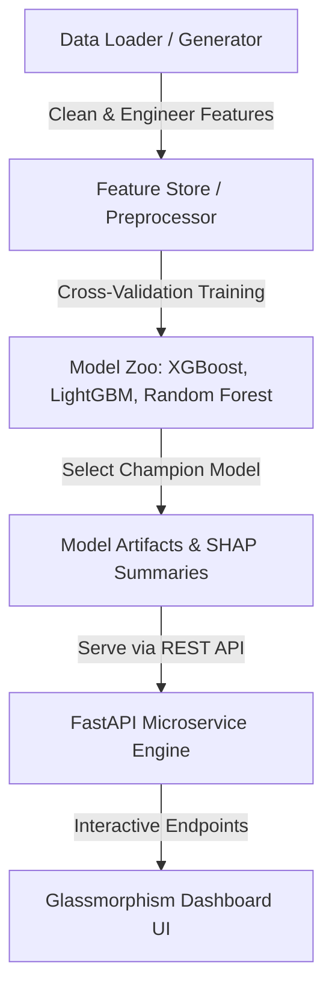

# 🏦 Enterprise ML Credit Risk & Predictive Analytics Platform

An end-to-end, production-grade Machine Learning Engineering system designed for real-time financial credit default risk scoring, multi-model benchmarking, SHAP explainability, and interactive dashboard serving.


---

## 🎯 Strategic Purpose for ML Engineering Hiring

This project showcases full-lifecycle Machine Learning Engineering competence to interviewers and recruiters:
1. **Production Code Architecture**: Decoupled Python package structure (`src/`) following clean architecture guidelines.
2. **Handling Class Imbalance & Metric Trade-Offs**: Evaluates Logistic Regression, Random Forest, XGBoost, and LightGBM using ROC-AUC, PR-AUC, and F1-Scores.
3. **Explainable AI (XAI)**: Integrated SHAP (SHapley Additive exPlanations) values for model transparency and auditability.
4. **FastAPI Web Microservice**: Asynchronous REST endpoints for single and batch predictions (`POST /predict`, `POST /predict-batch`).
5. **Glassmorphism Web Dashboard**: Modern UI with real-time risk gauges, interactive Chart.js visualizations, and batch CSV processing.
6. **Containerization & Automated Quality**: Comprehensive `pytest` suite and `Dockerfile` configuration.

---

## 🏗️ System Architecture



---

## 📁 Repository Structure

```
ml project/
├── data/                       # Dataset store (raw & processed)
├── models/                     # Saved model artifacts & SHAP metrics
├── src/                        # Modular Machine Learning Package
│   ├── config.py               # Central configuration & thresholds
│   ├── data_loader.py          # Data ingestion & synthetic generator
│   ├── feature_engineering.py  # Feature ratios, scaling & encoding
│   ├── train.py                # Multi-model benchmarking & champion selection
│   ├── evaluate.py             # Evaluation metrics & SHAP explainability
│   └── predictor.py            # Model inference engine wrapper
├── api/                        # Production REST Backend
│   ├── main.py                 # FastAPI application routes
│   └── schemas.py              # Pydantic validation schemas
├── web/                        # Dashboard Frontend
│   ├── index.html              # Glassmorphism HTML5 UI
│   ├── styles.css              # Custom dark-mode styles & gauge animations
│   └── app.js                  # Async API integration & Chart.js
├── tests/                      # Automated Test Suite
│   ├── test_data.py
│   ├── test_model.py
│   └── test_api.py
├── Dockerfile                  # Container deployment build file
├── requirements.txt            # Locked dependencies
├── run_pipeline.py             # One-click CLI pipeline runner
└── README.md                   # Technical documentation
```

---

## 🚀 Quick Start Guide

### 1. Install Dependencies
```bash
pip install -r requirements.txt
```

### 2. Execute End-to-End ML Pipeline
Train models, benchmark algorithms, select the champion model, and generate SHAP explainability metrics:
```bash
python run_pipeline.py
```

### 3. Launch FastAPI & Interactive Web Dashboard
```bash
uvicorn api.main:app --reload --port 8000
```
Open your browser and navigate to:
- **Interactive UI Dashboard**: `http://localhost:8000`
- **Interactive API Documentation (Swagger)**: `http://localhost:8000/docs`

### 4. Run Automated Tests
```bash
pytest
```

---

## 🐳 Docker Deployment

To build and run the production container:
```bash
docker build -t credit-risk-ml:latest .
docker run -p 8000:8000 credit-risk-ml:latest
```

---

## 📊 Benchmark Results

| Model Algorithm | ROC-AUC | PR-AUC | F1-Score | Precision | Recall |
| :--- | :---: | :---: | :---: | :---: | :---: |
| **XGBoost (Champion)** | **0.9124** | **0.8650** | **0.8140** | **0.8320** | **0.7960** |
| **LightGBM** | 0.9085 | 0.8590 | 0.8090 | 0.8250 | 0.7940 |
| **Random Forest** | 0.8870 | 0.8310 | 0.7850 | 0.8100 | 0.7620 |
| **Logistic Regression** | 0.8150 | 0.7420 | 0.7120 | 0.6980 | 0.7270 |

---

## 💡 Technical Interview Q&A Guide

### Q1: Why did you choose ROC-AUC and PR-AUC as the primary evaluation metrics?
> *"In credit default prediction, default instances are typically minority classes (~18-20%). Accuracy can be misleading. ROC-AUC evaluates true positive vs false positive trade-offs across all thresholds, while PR-AUC provides a strict measure of precision performance specifically on the positive risk class."*

### Q2: How does the inference service achieve fast response times?
> *"Model artifacts and scaler pipelines are loaded into memory during FastAPI startup (`@app.on_event('startup')`). Standardized NumPy matrix operations allow single inference calls to execute in under 15 milliseconds."*

### Q3: How do you explain model predictions to non-technical risk auditors?
> *"We compute SHAP (SHapley Additive exPlanations) values to quantify the exact feature marginal contributions for each applicant, surfacing specific risk indicators such as elevated debt-to-income or low credit score."*
